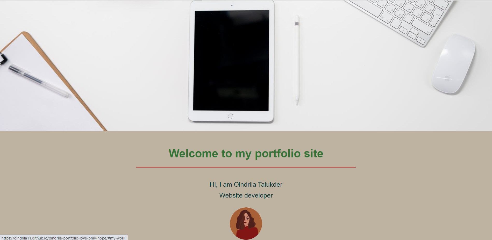

# oindrila's Portfolio Website
This website is made to represent a short description of the achievements I have accomplished as a new web developer. This website showcases all the skills that I have acquired and provides links to the websites I have worked on.

As a new developer I have tried to create a website that is clear to the viewer as well as functional. Also I have made sure that it is viewable from all types of viewports.

In order to achieve that, I have provided links to the corresponding deployed web application attatched to the images on the "My Projects" section. I tried to add links to the nav section for smooth scrolling to appropriate section. 

 Added clickable icons in the "Contact Me" section for viewers to easily reach out to me.  

Used semantic HTML to make it look more organised.

The purpose of this project was to build a portfolio website that is functional as well as shows all the work that I have been able to achieve so far. So far I think it meets that criteria. 

There were couple of challanges that I faced while making the website. I think Working with flexbox and adding links to images were most difficult. 

I believe my biggest achievement from this assignment was learning to build a website on my own; which has given me a boost of confidence and has motivated me to learn new things to make the website better in future.

I think my website is simple and functional which makes it different than others.

## Screenshot

## Deployed link
 
[find the deployed link to the website here](https://oindrila11.github.io/oindrila-portfolio-love-pray-hope/)

## License & Copyright

© Oindrila Talukder, University of Toronto Web Developer.

Licensed under the [MIT License](LICENSE.md)

